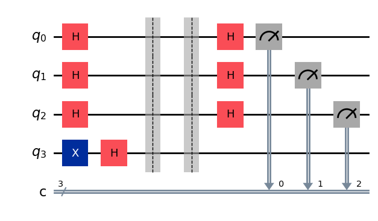
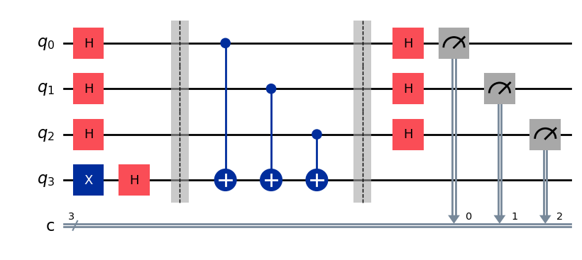
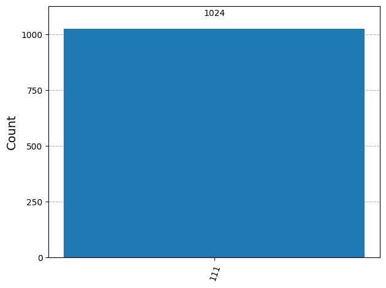

1. Objective

    The primary objective of this project is to demonstrate the quantum advantage of the Deutsch-Jozsa algorithm. Specifically, we aim to verify that a quantum computer can distinguish between a Constant function (outputs are identical for all inputs) and a Balanced function (outputs are 0 for half the inputs and 1 for the other half) using only a single query to the oracle.

2. Methodology

    We implemented the algorithm using Qiskit, constructing quantum circuits for $n=1, 2,$ and $3$ qubits.

    The Oracle Structure

    The core of the algorithm depends on the Oracle ($U_f$), a reversible unitary operation. We constructed two types of oracles:

    Constant Oracles: Implemented using identity gates (for $f(x)=0$) or X-gates on the ancilla (for $f(x)=1$). These apply no phase change relative to the input state.

    Balanced Oracles: Implemented using CNOT gates wrapping the input qubits. This effectively encodes the function structure into the phase of the quantum state via "phase kickback."

    The circuit follows the standard procedure:

    Initialize $n$ qubits to $\ket{0}$ and one ancilla to $\ket{1}$.

    Apply Hadamard gates to create a uniform superposition of all $2^n$ possible inputs.

    Apply the Oracle $U_f$ (the "Black Box").

    Apply Hadamard gates again to create interference.

    Measure the input register.

3. Results and Empirical Verification

    We executed the circuits on a noise-free simulator (AerSimulator) with 1024 shots. The results conclusively demonstrate the algorithm's deterministic nature.

    Case 1: Constant Function Analysis

    For the constant function test, we expected constructive interference to amplify the probability amplitude of the all-zero state $\ket{00\dots0}$.

    
    

    Figure 1: Measurement results for a 2-qubit Constant Oracle.

    Observation: As shown in Figure 1, the system measured the state 00 (all zeros) with a probability of 1.0 (1024/1024 shots). This confirms that the algorithm correctly identifies a constant function by converging on the zero state.

    Case 2: Balanced Function Analysis

    For the balanced function test, we expected destructive interference to completely cancel out the amplitude of the $\ket{00\dots0}$ state, transferring the probability to orthogonal states.

    
    

    Figure 2: Measurement results for a 2-qubit Balanced Oracle (Parity).

    Observation: As shown in Figure 2, the system measured the state 11 (non-zero) with a probability of 1.0. Since the result is not 00, the algorithm correctly identifies the function as Balanced.

4. Complexity Analysis: Quantum vs. Classical

    The most significant outcome of this project is the demonstration of exponential speedup in query complexity.

    To determine if a function $f: \{0,1\}^n \to \{0,1\}$ is constant or balanced with 100% certainty:

    | Feature | Classical Computer | Quantum Computer (Deutsch-Jozsa) |
    | :--- | :--- | :--- |
    | **Query Method** | Must check inputs sequentially (one by one). | Evaluates $f(x)$ for all $2^n$ inputs simultaneously using superposition. |
    | **Worst Case Queries** | $2^{n-1} + 1$ | **1** |
    | **For n=3 Qubits** | Requires $2^{3-1} + 1 = \mathbf{5}$ queries. | Requires **1** query. |
    | **Scaling** | Exponential time $O(2^n)$. | Constant time $O(1)$. |

    Mathematical Derivation

    In the classical worst-case scenario, if we check $2^{n-1}$ inputs (half the possibilities) and they all return the same value (e.g., 0), we still cannot be certain the function is constant. The very next input could return 1, making it balanced. Therefore, we must check $2^{n-1} + 1$ inputs to know for sure.

    In the quantum scenario, the Deutsch-Jozsa algorithm leverages interference. The amplitude of the $\ket{0}^{\otimes n}$ state after the final Hadamard transformation is given by:

    $$\sum_{x \in \{0,1\}^n} (-1)^{f(x)}$$

    If $f(x)$ is constant, the terms sum constructively.

    If $f(x)$ is balanced, the positive and negative terms cancel out exactly to zero.

5. Conclusion

    Our implementation successfully verified the Deutsch-Jozsa algorithm. By identifying the function type with a single oracle query, we have empirically demonstrated the $O(1)$ quantum query complexity, validating the theoretical prediction of exponential speedup over the classical $O(2^n)$ counterpart.